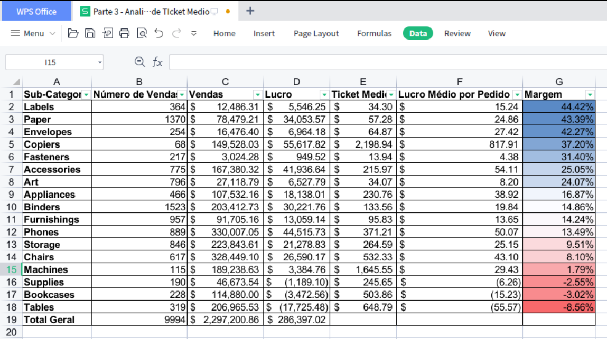
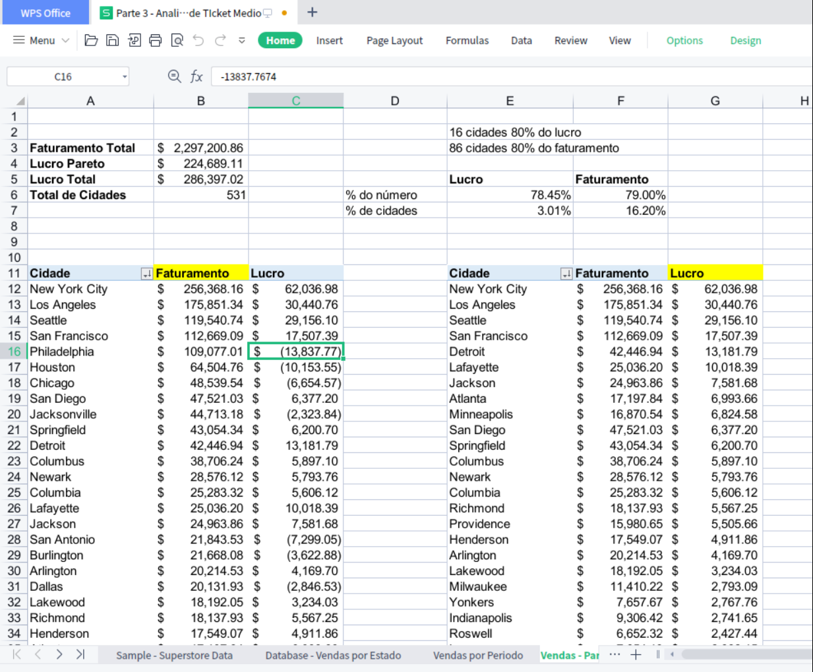

📊 Análise de Vendas, Lucro e Ticket Médio — Superstore Dataset (Excel)

Este projeto apresenta uma análise exploratória e descritiva de dados de vendas de uma superloja fictícia localizada nos Estados Unidos, utilizando Excel (WPS 2019) e dados públicos conhecidos como Superstore Dataset (originalmente disponibilizado pela Tableau e amplamente utilizado para fins educacionais).

O objetivo do projeto é demonstrar habilidades práticas de análise de dados orientada a negócio, explorando métricas como faturamento, lucro, ticket médio, margem e concentração de resultados, além de comunicar insights de forma clara e objetiva.

🗂️ Sobre os dados

Dataset público e anonimizado (uso educacional)

Dados de vendas de uma superloja nos EUA

Principais campos analisados:

Receita (Sales)

Lucro (Profit)

Pedido (Order ID)

Subcategoria de produto

Datas (ano e mês)

Localização (estado / cidade)

Segmentos de clientes

🛠️ Ferramentas utilizadas

Excel / WPS Office 2019

Tabelas Dinâmicas (Pivot Tables)

Fórmulas e métricas calculadas

Visualizações gráficas simples

Análise orientada a KPIs

📈 Visão Geral e KPIs

A análise parte de uma visão consolidada dos principais indicadores do negócio:

Receita Total: US$ 2.297.200

Lucro Total: US$ 286.397

Número Total de Pedidos: 9.994

Ticket Médio Geral: ~US$ 230

Margem Global: ~12,5%

Esses KPIs permitem uma leitura rápida da performance geral antes de aprofundar nas análises detalhadas.

⏳ Análise Temporal

Foi realizada uma análise da evolução da receita ao longo do tempo, observando o comportamento anual e mensal das vendas.

Principais observações:

Crescimento consistente da receita nos anos mais recentes do dataset.

Presença de sazonalidade, com queda de faturamento nos primeiros meses do ano.

Picos recorrentes de vendas nos últimos meses, especialmente no quarto trimestre.

Essa análise ajuda a entender padrões de consumo e possíveis impactos de sazonalidade no resultado do negócio.

📊 Análise de Mix de Produtos, Ticket Médio e Margem

Para aprofundar a análise, foi construída uma tabela consolidada por Subcategoria de Produto, contendo:

Número de pedidos

Receita total

Lucro total

Ticket médio de faturamento

Lucro médio por pedido

Margem (%)

A tabela dinâmica foi convertida em valores estáticos para permitir ordenações consistentes e análises comparativas entre ticket médio, lucro e margem.

Principais insights:

Algumas subcategorias apresentam ticket médio elevado, mas margem negativa, indicando possíveis problemas de custo ou precificação (ex.: Tables, Supplies).

Produtos com menor volume, porém ticket médio alto e margens positivas (ex.: Copiers), indicam um perfil de produto premium saudável.

Subcategorias de alto volume e margem moderada (ex.: Binders, Phones) sustentam grande parte da receita total.

📌 Essa análise evidencia que alto faturamento não significa necessariamente bom resultado financeiro.

📉 Análise de Margem

A visualização de margem por subcategoria reforça a importância de analisar qualidade da receita, e não apenas volume.

Margens negativas indicam riscos operacionais.

Margens elevadas em produtos de baixo volume podem representar oportunidades de crescimento estratégico.

📉 Análise de Concentração de Resultados (Pareto 80/20)

Foi realizada uma análise de Pareto para avaliar a concentração de faturamento e lucro por cidade, com o objetivo de identificar o grau de dependência do negócio em relação a poucos mercados.

A análise mostrou que:

Apenas 16 cidades (3,01% do total) concentram aproximadamente 78,45% do lucro total.

86 cidades (16,20% do total) são responsáveis por cerca de 79,00% do faturamento total.

O total analisado contempla 531 cidades, evidenciando uma forte assimetria na distribuição dos resultados.

Esses dados indicam que o lucro do negócio é ainda mais concentrado do que o faturamento, sugerindo que uma parcela muito reduzida das cidades não apenas gera maior volume de vendas, mas também apresenta melhor eficiência operacional e rentabilidade.

📌 Insight-chave:
Embora o faturamento esteja relativamente distribuído entre um número maior de cidades, a geração de lucro depende fortemente de poucos mercados específicos. Isso sugere oportunidades estratégicas de foco, como:

priorização de cidades altamente rentáveis,

revisão de custos e margens em cidades com alto faturamento e baixa rentabilidade,

mitigação de riscos operacionais associados à concentração excessiva de lucro.

🧠 Principais Conclusões

O negócio apresenta forte concentração de receita e lucro em poucas subcategorias.

Ticket médio elevado não garante rentabilidade se a margem for negativa.

A análise integrada de volume, ticket médio, lucro e margem fornece uma visão mais madura da performance do negócio.

A abordagem adotada permite apoiar decisões relacionadas a precificação, mix de produtos e foco operacional.

⚠️ Observações finais

Este projeto tem finalidade exclusivamente educacional.

Os dados são públicos e não representam operações reais.
