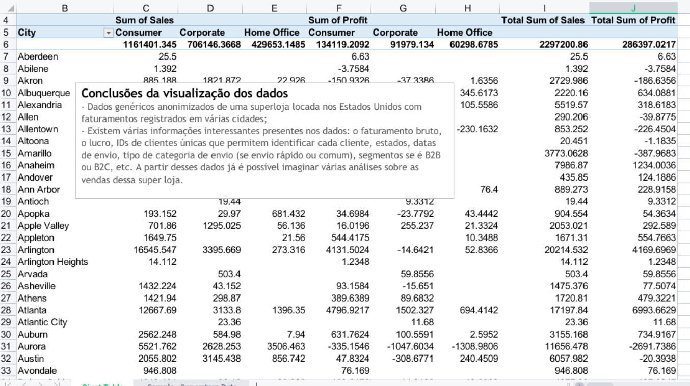
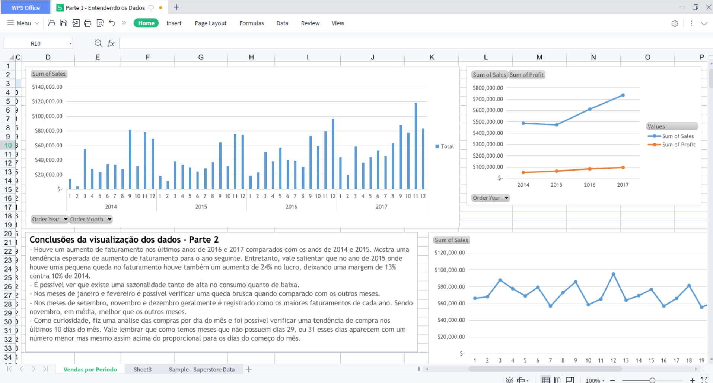

📊 Análise de Vendas em Excel — Superstore Dataset
🎯 Objetivo

Este projeto tem como objetivo analisar o desempenho de vendas, a lucratividade e o comportamento dos clientes utilizando o dataset Superstore. A análise busca identificar tendências, padrões de sazonalidade, concentração de receita e oportunidades para apoiar a tomada de decisão do negócio.

🗂️ Conjunto de Dados

Dataset público de caráter educacional, originalmente disponibilizado pela Tableau e posteriormente divulgado na plataforma Kaggle.
Os dados representam uma superloja fictícia localizada nos Estados Unidos, com transações anonimizadas registradas em diversas cidades e estados.

🧰 Ferramentas Utilizadas

Excel (WPS 2019)

Tabelas Dinâmicas (Pivot Tables)

Agregações e cálculos básicos

🔍 Visão Geral da Análise

1. Exploração dos Dados

Foi realizada uma exploração inicial dos dados por meio de tabelas dinâmicas para compreender a estrutura do dataset, incluindo:

Receita e lucro

Clientes e produtos

Distribuição geográfica

Informações de pedidos e envio

Segmentos B2B e B2C

2. Tendência de Receita e Lucro
   

Observa-se um crescimento consistente da receita nos anos de 2016 e 2017 em comparação com 2014 e 2015.

Apesar de uma leve queda no faturamento em 2015, o lucro apresentou um aumento aproximado de 24%, resultando em uma melhoria de margem de 10% (2014) para 13% (2015).

Esse comportamento sugere maior eficiência operacional ou ajustes positivos em preços e custos no período.

3. Análise de Sazonalidade

Foram identificados padrões claros de sazonalidade nas vendas:

Queda significativa nos meses de janeiro e fevereiro

Desempenho elevado nos meses de setembro, novembro e dezembro

Novembro se destaca como o mês de maior faturamento médio

4. Comportamento de Compra ao Longo do Mês

Uma análise exploratória por dia do mês indica maior volume de compras nos últimos 10 dias do mês.

Embora alguns dias (29, 30 e 31) apareçam com menor frequência devido à variação do calendário, o padrão geral mostra uma concentração maior de compras no final do mês quando comparado aos primeiros dias.

💡 Principais Insights

As vendas apresentam forte sazonalidade, com maior concentração no último trimestre do ano.

A lucratividade nem sempre acompanha o crescimento da receita, reforçando a importância da análise de margem.

O comportamento de compra dos clientes sugere possível influência de ciclos de pagamento ou faturamento.

📌 Recomendações de Negócio

Planejar estoques e ações de marketing considerando o aumento de demanda no último trimestre do ano.

Investigar as estratégias de custo e precificação aplicadas em 2015 para replicar a melhoria de margem em outros períodos.

Avaliar campanhas promocionais direcionadas para o final do mês, período em que a intenção de compra se mostra mais elevada.

⚠️ Aviso

Este projeto foi desenvolvido exclusivamente para fins educacionais. Os dados utilizados não representam operações comerciais reais.
